# Knowledgegraph v3

This project provides a Dockerized stack to transfer events from the administration shell registry into a Neo4j database using a Kafka-Connect plugin. The Kafka-Connect plugin leverages [Pebble](https://pebbletemplates.io/) templates to format data and the [HTTP Sink Kafka Connector](https://github.com/clescot/kafka-connect-http) to send data to Neo4j.

## Prerequisites

Ensure your environment is set up with the following:

1. **Java Temurin [JDK 17](https://adoptium.net/de/temurin/releases/?os=windows&arch=x64&version=17)**
2. **[Apache Maven](https://maven.apache.org/download.cgi)**
3. **[Rancher Desktop](https://rancherdesktop.io/)** (or Docker)
4. **[Git](https://git-scm.com/downloads/win)**

### 1. Install Java Development Kit (JDK 17)

1. Visit [Eclipse Adoptium](https://adoptium.net/) and download the **LTS version** of **JDK 17** for your platform.
2. Install it and take note of the installation path.

**Set `JAVA_HOME`:**

- Open *System Properties* > *Advanced system settings* > *Environment Variables*.
- Add/Edit `JAVA_HOME`:

    ```
    C:\Program Files\Eclipse Adoptium\jdk-17.x.x-hotspot
    ```

- Add `%JAVA_HOME%\bin` to your system `Path`.

**Verify Installation:**

```bash
java --version
```

Expected output:
```
openjdk 17.x.x
```

### 2. Install Apache Maven

1. Download the latest version of [Apache Maven](https://maven.apache.org/download.cgi).
2. Extract it to a directory (e.g., `C:\maven\apache-maven-3.9.9`).

**Set `MAVEN_HOME`:**

- Open *System Properties* > *Advanced system settings* > *Environment Variables*.
- Add/Edit `MAVEN_HOME`:

    ```
    C:\maven\apache-maven-3.9.9
    ```

- Add `%MAVEN_HOME%\bin` to your system `Path`.

**Verify Installation:**

```bash
mvn --version
```

Expected output:
```
Apache Maven 3.x.x
```

### 3. Install Git

1. Download and install Git from [Git SCM](https://git-scm.com/).
2. Verify the installation:

```bash
git --version
```

Expected output:
```
git version x.x.x
```

**Enable Long Path Support (Windows):**

To avoid issues with deeply nested project files, run this command:

```bash
git config --global core.longpaths true
```

### 4. Install Docker or Rancher Desktop

1. [Enable WSL 2](https://pureinfotech.com/install-windows-subsystem-linux-2-windows-10/) (for Windows users).
2. Install [Rancher Desktop](https://rancherdesktop.io/) and configure it:
    - Use `dockerd` as the container runtime.
    - Disable Kubernetes during setup.

**Verify Docker Installation:**

```bash
docker run hello-world
```

Expected output:
```
Hello from Docker!
This message shows that your installation appears to be working correctly.
```

## Cloning and Building the Project

With the prerequisites complete, you can clone the repository and build the project.

```bash
git clone https://gitlab.basys.dfki.dev/i40/basys/aas-repository-neo4j-kafka-plugin
cd aas-repository-neo4j-kafka-plugin
```

## Running the Docker Stack

### Start the Stack

To start the Docker stack, run the following command:

```bash
./up.sh
```

or:

```bash
docker-compose --project-name knowledgegraph-v3 up --detach --remove-orphans --force-recreate --renew-anon-volumes
```

At the end of the script, URLs and credentials for the services will be displayed.

### Stop the Stack

To stop the stack, run:

```bash
./down.sh
```

or:

```bash
docker-compose --project-name knowledgegraph-v3 down
```

## UI Endpoints

### Basyx Services

| **Service**           | **Swagger UI / Endpoints**                  |
|-----------------------|---------------------------------------------|
| **AAS Environment**   | http://localhost:8081/swagger-ui/index.html |
| **AAS Registry**      | http://localhost:8083/swagger-ui/index.html |
| **Submodel Registry** | http://localhost:8082/swagger-ui/index.html |
| **AAS GUI**           | http://localhost:8099/                      |

### Kafka

| **Service**          | **URL**               |
|----------------------|-----------------------|
| **AKHQ UI**          | http://localhost:8086 |
| **Kafka Connect UI** | http://localhost:8094 |

### Neo4j

| **Service**  | **URL**               |
|--------------|-----------------------|
| **Neo4j UI** | http://localhost:7474 |

### Portainer

| **Service**      | **URL**               |
|------------------|-----------------------|
| **Portainer UI** | http://localhost:8084 |


## Project Overview

The `docker-compose.yml` defines several services. Each service has its own environment variables and configuration. Below is a summary of the services and their purpose.

| **Service**           | **Description**                              | **External Port**               | **Internal Port** |
|-----------------------|----------------------------------------------|---------------------------------|-------------------|
| **aas-environment**   | Basyx AAS environment with Kafka integration | [`8081`](http://localhost:8081) | `8081`            |
| **submodel-registry** | Basyx Submodel Registry                      | [`8082`](http://localhost:8082) | `8080`            |
| **aas-registry**      | Basyx AAS registry with Kafka integration    | [`8083`](http://localhost:8083) | `8080`            |
| **aas-gui**           | Basyx AAS GUI                                | [`8099`](http://localhost:8099) | `3000`            |
| **akhq**              | Web UI for managing Kafka topics             | [`8086`](http://localhost:8086) | `8080`            |
| **kafka**             | Kafka broker for messaging and topics        | [`9092`](http://localhost:9092) | `9094`            |
| **kafka-connect**     | Kafka Connect with Neo4j integration         | [`8085`](http://localhost:8085) | `8083`            |
| **kafka-connect-ui**  | UI for Kafka Connect                         | [`8094`](http://localhost:8094) | `8000`            |
| **neo4j**             | Neo4j browser interface                      | [`7474`](http://localhost:7474) | `7474`            |
| **neo4j**             | Neo4j bolt protocol                          | [`7687`](http://localhost:7687) | `7687`            |
| **portainer**         | Manage containers via Portainer CE           | [`8084`](http://localhost:8084) | `9000`            |

```mermaid
graph TD;
    Start((Start)):::start --> Kafka[Kafka]:::kafka;
    Start --> Neo4j[Neo4j]:::neo4j;

    %% Kafka-abhängige Services
    Kafka -->|"service_started"| AKHQ[AKHQ]:::kafka;
    Kafka -->|"service_started"| AASRegistry[AAS Registry]:::basyx;
    Kafka -->|"service_started"| SubmodelRegistry[Submodel Registry]:::basyx;

    %% Neo4j-abhängige Services
    Neo4j -->|"service_healthy"| KafkaConnect[Kafka Connect]:::kafka;

    %% AAS Environment hängt von Registry und Submodel Registry ab
    AASRegistry -->|"service_healthy"| AASEnvironment[AAS Environment]:::basyx;
    SubmodelRegistry -->|"service_healthy"| AASEnvironment;

    %% Junction für AAS GUI (drei Bedingungen müssen erfüllt sein)
    AASRegistry -->|"service_healthy"| AASGUI_Junction((J)):::junction;
    SubmodelRegistry -->|"service_healthy"| AASGUI_Junction;
    AASEnvironment -->|"service_healthy"| AASGUI_Junction;
    AASGUI_Junction --> AASGUI[AAS GUI]:::basyx;

    %% Kafka Connect UI hängt von Kafka Connect ab
    KafkaConnect -->|"service_healthy"| KafkaConnectUI[Kafka Connect UI]:::kafka;

    %% Style Definitionen
    classDef kafka fill:#ffcccc,stroke:#b30000,stroke-width:1px;
    classDef basyx fill:#ccffcc,stroke:#008000,stroke-width:1px;
    classDef neo4j fill:#ccccff,stroke:#0000b3,stroke-width:1px;
    classDef junction fill:#333,stroke:#333,stroke-width:2px;
    classDef start fill:#ffcc00,stroke:#333,stroke-width:2px;
```




## Further Development

The project uses Pebble templates to define the target structure for HTTP requests sent to Neo4j. Below are some ideas for further development:

- **Initialize Neo4j indexes:** Add functionality to create indexes for `submodel` and `submodel-elements`.
- **Handle repository events:** Extend support for all repository events.
- **Extend test cases:** Add more test cases in `kafka-connect/java/src/test/resources/testcases`.
- **Automate worker configuration:** Move initialization of worker configurations from `curl` to the Kafka-Connect plugin.

### Testing with Maven

Navigate to the `kafka-connect/java` directory and build the Java project:

```bash
mvn clean install
```

To view the dependency tree:

```bash
mvn dependency:tree
```
